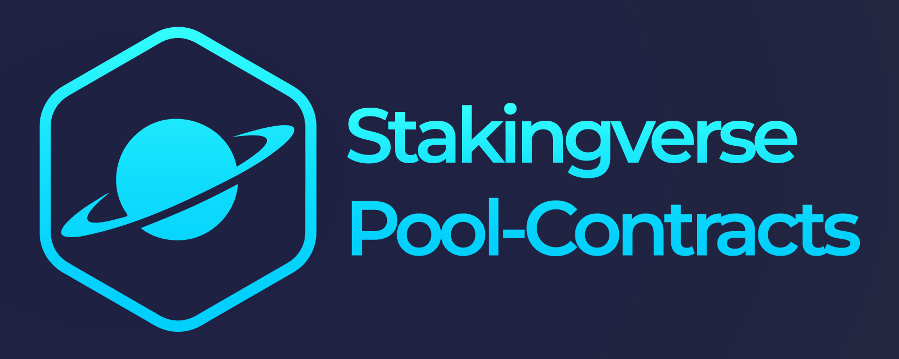

# Stakingverse Contracts



[](https://github.com/Stakingverse/pool-contracts/actions/workflows/build-test.yml) [](./README.md#code-coverage) [](https://discord.com/invite/AE3KdFhpAQ) [](https://docs.stakingverse.io/) [](https://docs.stakingverse.io/)

Repository for the Stakingverse contracts. This repository includes the following contracts:

- Stakingverse Vault (based on [Universal Page vault's implementation](https://github.com/Universal-Page/contracts/blob/main/src/pool/Vault.sol))
- Liquid Staking Token (sLYX) based on the LUKSO LSP7 standard (linked to the Vault contract below deployed on LUKSO Mainnet).

| Contract                                 | Address                                                                                                                                        |
| :--------------------------------------- | :--------------------------------------------------------------------------------------------------------------------------------------------- |
| Staking Vault Proxy                      | [`0x9F49a95b0c3c9e2A6c77a16C177928294c0F6F04`](https://explorer.lukso.network/address/0x9F49a95b0c3c9e2A6c77a16C177928294c0F6F04?tab=contract) |
| Staking Vault Implementation (Singleton) | `0x2Cb02ef26aDDAB15686ed634d70699ab64F195f4`                                                                                                   |

- [Stakingverse Contracts](#stakingverse-contracts)
  - [Installation](#installation)
  - [Build](#build)
  - [Tests](#tests)
  - [Analysis](#analysis)
    - [Code coverage](#code-coverage)
    - [Contract sizes](#contract-sizes)
    - [Gas costs](#gas-costs)
    - [Storage layout](#storage-layout)
    - [Intermediate representation - IR](#intermediate-representation---ir)
    - [Slither](#slither)

## Installation

```bash
# Install LUKSO and OpenZeppelin contracts dependencies
npm install

# Install forge contracts testing library
forge install https://github.com/foundry-rs/forge-std --no-commit --no-git
```

## Build

Run the following command to build the contract ABIs and generate extra outputs.

```shell
# Build contracts' ABI and bytecode
npm run build

# Build and display the contracts' bytecode sizes
npm run build:sizes

# Build contracts with storage layout in generated build
npm run build:storage

# Build contracts with IR as Yul code in generated build
npm run build:ir
```

## Tests

```shell
# Run all tests (including invariant tests)
npm run test

# Run only the invariant tests
npm run test:invariant

# Run all the tests and get the code coverage of the test suite
# NB: Invariant tests are skipped as they keep the test hanging
npm run test:coverage

# Run all the tests and get the gas usage of the functions of the contracts
npm run test:gas

# Run test against contract states of the mainnet fork
npm run test:fork
```

You can also display more log informations for debugging using the `:debug` suffix when running the tests with npm.

```shell
npm run test:debug
npm run test:invariant:debug
```

## Analysis

### Code coverage

Suite result: ok. 11 passed; 0 failed; 0 skipped; finished in 196.78s (332.05s CPU time)

Ran 11 test suites in 196.79s (520.99s CPU time): 95 tests passed, 0 failed, 0 skipped (95 total tests)

| File                                          | % Lines          | % Statements     | % Branches     | % Funcs        |
| --------------------------------------------- | ---------------- | ---------------- | -------------- | -------------- |
| src/SLYXToken.sol                             | 90.62% (29/32)   | 92.16% (47/51)   | 80.00% (4/5)   | 91.67% (11/12) |
| src/StakingverseVault.sol                     | 83.84% (166/198) | 83.95% (204/243) | 50.00% (23/46) | 82.86% (29/35) |
| test/base/SLYXTokenBaseTest.t.sol             | 100.00% (40/40)  | 100.00% (45/45)  | 100.00% (0/0)  | 100.00% (5/5)  |
| test/base/UniversalProfileTestHelpers.t.sol   | 100.00% (21/21)  | 100.00% (26/26)  | 100.00% (0/0)  | 100.00% (5/5)  |
| test/mocks/MockContractWithLSP1Reentrancy.sol | 87.50% (7/8)     | 90.91% (10/11)   | 50.00% (1/2)   | 100.00% (5/5)  |
| test/mocks/MockDepositContract.sol            | 33.33% (1/3)     | 25.00% (1/4)     | 100.00% (0/0)  | 33.33% (1/3)   |
| Total                                         | 87.42% (264/302) | 87.63% (333/380) | 52.83% (28/53) | 86.15% (56/65) |

### Contract sizes

| Contract          | Runtime Size (B) | Initcode Size (B) | Runtime Margin (B) | Initcode Margin (B) |
| ----------------- | ---------------- | ----------------- | ------------------ | ------------------- |
| SLYXToken         | 14,829           | 15,072            | 9,747              | 34,080              |
| StakingverseVault | 12,240           | 12,496            | 12,336             | 36,656              |

### Gas costs

| src/SLYXToken.sol:SLYXToken contract |                 |        |        |        |         |
| ------------------------------------ | --------------- | ------ | ------ | ------ | ------- |
| Deployment Cost                      | Deployment Size |        |        |        |         |
| 3271420                              | 15072           |        |        |        |         |
| Function Name                        | min             | avg    | median | max    | # calls |
| authorizeOperator                    | 11939           | 95885  | 96706  | 124192 | 7186    |
| authorizedAmountFor                  | 897             | 897    | 897    | 897    | 258     |
| balanceOf                            | 599             | 819    | 599    | 2599   | 4660    |
| batchCalls                           | 811             | 811    | 811    | 811    | 37      |
| burn                                 | 3086            | 29034  | 10856  | 112721 | 1041    |
| decimals                             | 2458            | 2458   | 2458   | 2458   | 2       |
| deposit                              | 3699            | 3699   | 3699   | 3699   | 2       |
| getData                              | 3478            | 4165   | 3478   | 5540   | 6       |
| getNativeTokenValue                  | 3528            | 3528   | 3528   | 3528   | 7       |
| getSLYXTokenValue                    | 3593            | 3593   | 3593   | 3593   | 5       |
| initialize                           | 24632           | 175305 | 177588 | 177588 | 67      |
| onVaultStakeReceived                 | 2814            | 54189  | 58576  | 189334 | 3113    |
| owner                                | 2376            | 2376   | 2376   | 2376   | 1       |
| pause                                | 2520            | 14258  | 25809  | 25809  | 518     |
| paused                               | 360             | 1358   | 360    | 2360   | 525     |
| receive                              | 122             | 122    | 122    | 122    | 1       |
| revokeOperator                       | 10126           | 10126  | 10126  | 10126  | 1       |
| stakingVault                         | 2428            | 2428   | 2428   | 2428   | 257     |
| supportsInterface                    | 429             | 1708   | 671    | 4024   | 8575    |
| totalSupply                          | 350             | 1340   | 350    | 2350   | 521     |
| transfer                             | 1171            | 24611  | 14663  | 45689  | 1030    |
| unpause                              | 2477            | 2509   | 2477   | 8643   | 258     |

### Storage layout

<details>
    <summary><code>SLYXToken</code> - storage layout (JSON)</summary>

```json
[
  {
    "astId": 52601,
    "contract": "src/SLYXToken.sol:SLYXToken",
    "label": "_initialized",
    "offset": 0,
    "slot": "0",
    "type": "t_uint8"
  },
  {
    "astId": 52604,
    "contract": "src/SLYXToken.sol:SLYXToken",
    "label": "_initializing",
    "offset": 1,
    "slot": "0",
    "type": "t_bool"
  },
  {
    "astId": 53356,
    "contract": "src/SLYXToken.sol:SLYXToken",
    "label": "__gap",
    "offset": 0,
    "slot": "1",
    "type": "t_array(t_uint256)50_storage"
  },
  {
    "astId": 52473,
    "contract": "src/SLYXToken.sol:SLYXToken",
    "label": "_owner",
    "offset": 0,
    "slot": "51",
    "type": "t_address"
  },
  {
    "astId": 52593,
    "contract": "src/SLYXToken.sol:SLYXToken",
    "label": "__gap",
    "offset": 0,
    "slot": "52",
    "type": "t_array(t_uint256)49_storage"
  },
  {
    "astId": 53401,
    "contract": "src/SLYXToken.sol:SLYXToken",
    "label": "__gap",
    "offset": 0,
    "slot": "101",
    "type": "t_array(t_uint256)50_storage"
  },
  {
    "astId": 40445,
    "contract": "src/SLYXToken.sol:SLYXToken",
    "label": "_store",
    "offset": 0,
    "slot": "151",
    "type": "t_mapping(t_bytes32,t_bytes_storage)"
  },
  {
    "astId": 50902,
    "contract": "src/SLYXToken.sol:SLYXToken",
    "label": "_isNonDivisible",
    "offset": 0,
    "slot": "152",
    "type": "t_bool"
  },
  {
    "astId": 50904,
    "contract": "src/SLYXToken.sol:SLYXToken",
    "label": "_existingTokens",
    "offset": 0,
    "slot": "153",
    "type": "t_uint256"
  },
  {
    "astId": 50908,
    "contract": "src/SLYXToken.sol:SLYXToken",
    "label": "_tokenOwnerBalances",
    "offset": 0,
    "slot": "154",
    "type": "t_mapping(t_address,t_uint256)"
  },
  {
    "astId": 50913,
    "contract": "src/SLYXToken.sol:SLYXToken",
    "label": "_operators",
    "offset": 0,
    "slot": "155",
    "type": "t_mapping(t_address,t_struct(AddressSet)56908_storage)"
  },
  {
    "astId": 50919,
    "contract": "src/SLYXToken.sol:SLYXToken",
    "label": "_operatorAuthorizedAmount",
    "offset": 0,
    "slot": "156",
    "type": "t_mapping(t_address,t_mapping(t_address,t_uint256))"
  },
  {
    "astId": 52785,
    "contract": "src/SLYXToken.sol:SLYXToken",
    "label": "_paused",
    "offset": 0,
    "slot": "157",
    "type": "t_bool"
  },
  {
    "astId": 52890,
    "contract": "src/SLYXToken.sol:SLYXToken",
    "label": "__gap",
    "offset": 0,
    "slot": "158",
    "type": "t_array(t_uint256)49_storage"
  },
  {
    "astId": 57917,
    "contract": "src/SLYXToken.sol:SLYXToken",
    "label": "stakingVault",
    "offset": 0,
    "slot": "207",
    "type": "t_contract(IVault)57846"
  }
]
```

</details>


<details>
    <summary><code>StakingverseVault</code> - storage layout (JSON)</summary>

```json
[
  {
    "astId": 41698,
    "contract": "src/StakingverseVault.sol:StakingverseVault",
    "label": "_owner",
    "offset": 0,
    "slot": "0",
    "type": "t_address"
  },
  {
    "astId": 52601,
    "contract": "src/StakingverseVault.sol:StakingverseVault",
    "label": "_initialized",
    "offset": 20,
    "slot": "0",
    "type": "t_uint8"
  },
  {
    "astId": 52604,
    "contract": "src/StakingverseVault.sol:StakingverseVault",
    "label": "_initializing",
    "offset": 21,
    "slot": "0",
    "type": "t_bool"
  },
  {
    "astId": 52906,
    "contract": "src/StakingverseVault.sol:StakingverseVault",
    "label": "_status",
    "offset": 0,
    "slot": "1",
    "type": "t_uint256"
  },
  {
    "astId": 52975,
    "contract": "src/StakingverseVault.sol:StakingverseVault",
    "label": "__gap",
    "offset": 0,
    "slot": "2",
    "type": "t_array(t_uint256)49_storage"
  },
  {
    "astId": 53356,
    "contract": "src/StakingverseVault.sol:StakingverseVault",
    "label": "__gap",
    "offset": 0,
    "slot": "51",
    "type": "t_array(t_uint256)50_storage"
  },
  {
    "astId": 52785,
    "contract": "src/StakingverseVault.sol:StakingverseVault",
    "label": "_paused",
    "offset": 0,
    "slot": "101",
    "type": "t_bool"
  },
  {
    "astId": 52890,
    "contract": "src/StakingverseVault.sol:StakingverseVault",
    "label": "__gap",
    "offset": 0,
    "slot": "102",
    "type": "t_array(t_uint256)49_storage"
  },
  {
    "astId": 58378,
    "contract": "src/StakingverseVault.sol:StakingverseVault",
    "label": "depositLimit",
    "offset": 0,
    "slot": "151",
    "type": "t_uint256"
  },
  {
    "astId": 58380,
    "contract": "src/StakingverseVault.sol:StakingverseVault",
    "label": "totalShares",
    "offset": 0,
    "slot": "152",
    "type": "t_uint256"
  },
  {
    "astId": 58382,
    "contract": "src/StakingverseVault.sol:StakingverseVault",
    "label": "totalStaked",
    "offset": 0,
    "slot": "153",
    "type": "t_uint256"
  },
  {
    "astId": 58384,
    "contract": "src/StakingverseVault.sol:StakingverseVault",
    "label": "totalUnstaked",
    "offset": 0,
    "slot": "154",
    "type": "t_uint256"
  },
  {
    "astId": 58386,
    "contract": "src/StakingverseVault.sol:StakingverseVault",
    "label": "totalPendingWithdrawal",
    "offset": 0,
    "slot": "155",
    "type": "t_uint256"
  },
  {
    "astId": 58388,
    "contract": "src/StakingverseVault.sol:StakingverseVault",
    "label": "totalValidatorsRegistered",
    "offset": 0,
    "slot": "156",
    "type": "t_uint256"
  },
  {
    "astId": 58390,
    "contract": "src/StakingverseVault.sol:StakingverseVault",
    "label": "fee",
    "offset": 0,
    "slot": "157",
    "type": "t_uint32"
  },
  {
    "astId": 58392,
    "contract": "src/StakingverseVault.sol:StakingverseVault",
    "label": "feeRecipient",
    "offset": 4,
    "slot": "157",
    "type": "t_address"
  },
  {
    "astId": 58394,
    "contract": "src/StakingverseVault.sol:StakingverseVault",
    "label": "totalFees",
    "offset": 0,
    "slot": "158",
    "type": "t_uint256"
  },
  {
    "astId": 58396,
    "contract": "src/StakingverseVault.sol:StakingverseVault",
    "label": "restricted",
    "offset": 0,
    "slot": "159",
    "type": "t_bool"
  },
  {
    "astId": 58399,
    "contract": "src/StakingverseVault.sol:StakingverseVault",
    "label": "_depositContract",
    "offset": 1,
    "slot": "159",
    "type": "t_contract(IDepositContract)57577"
  },
  {
    "astId": 58403,
    "contract": "src/StakingverseVault.sol:StakingverseVault",
    "label": "_shares",
    "offset": 0,
    "slot": "160",
    "type": "t_mapping(t_address,t_uint256)"
  },
  {
    "astId": 58407,
    "contract": "src/StakingverseVault.sol:StakingverseVault",
    "label": "_oracles",
    "offset": 0,
    "slot": "161",
    "type": "t_mapping(t_address,t_bool)"
  },
  {
    "astId": 58411,
    "contract": "src/StakingverseVault.sol:StakingverseVault",
    "label": "_pendingWithdrawals",
    "offset": 0,
    "slot": "162",
    "type": "t_mapping(t_address,t_uint256)"
  },
  {
    "astId": 58415,
    "contract": "src/StakingverseVault.sol:StakingverseVault",
    "label": "_allowlisted",
    "offset": 0,
    "slot": "163",
    "type": "t_mapping(t_address,t_bool)"
  },
  {
    "astId": 58419,
    "contract": "src/StakingverseVault.sol:StakingverseVault",
    "label": "_registeredKeys",
    "offset": 0,
    "slot": "164",
    "type": "t_mapping(t_bytes_memory_ptr,t_bool)"
  },
  {
    "astId": 58422,
    "contract": "src/StakingverseVault.sol:StakingverseVault",
    "label": "totalClaimable",
    "offset": 0,
    "slot": "165",
    "type": "t_uint256"
  },
  {
    "astId": 58424,
    "contract": "src/StakingverseVault.sol:StakingverseVault",
    "label": "operator",
    "offset": 0,
    "slot": "166",
    "type": "t_address"
  }
]
```

</details>


### Intermediate representation - IR

To see the intermediate representation of the contracts via IR (unoptimised) as Yul code, see the [`ir/`](./ir/README.md) folder. The folder also includes instruction on how to build the contracts via IR, if you are looking to re-generate the IR code.

### Slither

Command to generate the output of Slither. The output is available under the `audits/` folder as [`slither_report_SLYXToken.md`](./audits/slither_report_SLYXToken.md) and [`slither_report_StakingverseVault.md`](./audits/slither_report_StakingverseVault.md).

```shell
# For the Vault
slither src/StakingverseVault.sol --checklist --no-fail-pedantic --show-ignored-findings > slither_report_StakingverseVault.md

# For sLYX token contract
slither src/SLYXToken.sol --checklist --no-fail-pedantic --show-ignored-findings > slither_report_sLYX.md
```
